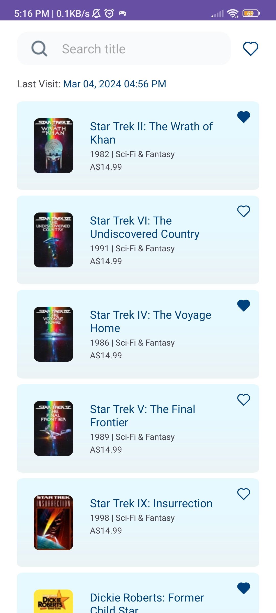
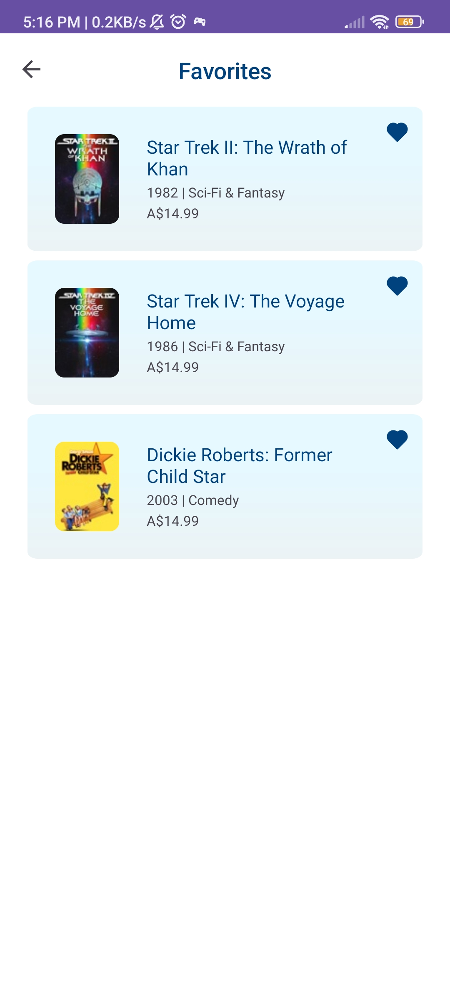
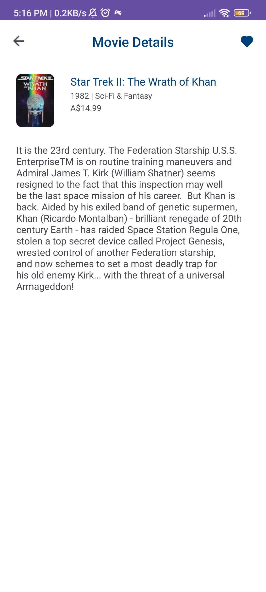

**Android Technical Document (iMovies App)**

A technical document for Android, is a comprehensive document that outlines the technical aspects of an Android application. It contains detailed information on the application's design, development, and testing. Some critical elements of a technical document for Android include: 

1. Getting Started 
1. Tech Stack 
1. Code Conventions 

**Getting Started** 

**Prerequisites** 

1. Android Studio Version Dolphin | 2021.3.1 or Higher 
2. Android SDK - download here (By default, Android Studio already contains Android SDK) 

**Android Specification Overview** 

- Minimum: Level 24 ( Android 7.0 - Nougat ) 
- Maximum: Level 33 ( Android 13 - Tiramisu ) 

**Installation** 

These instructions will get you a copy of the project and run it on your local machine for development and testing. 

1. **Clone this repo to your local machine using a terminal with this command** 

https://github.com/whatsername0414/iMovies.git 

2. **Import the project into android studio:**

File >> Import Project >> Select the cloned repository 

3. **Navigate to *local.properties* from the root project and add the below code** 

*release.jks.path=*

*release.jks.alias=*

*release.jks.aliasPassword=*

*release.jks.password=*

[keystore credentials](documentationAssets/keystore_creds.txt)

||||
| :- | :- | :- |
|**Name** |**Key** |**Description** |
|Keystore path |*release.jks.path* |location of your keystore |
|Password |*release.jks.password* |Secure password for your keystore |
|Alias |*release.jks.alias* |Identifying name for your key |
|Password |*release.jks.aliasPasswo rd* |Secure password for your key. |

4. **Select Build Variant** 

|||
| :- | :- |
|**Variant Name** |**Description** |
|prod |This variant uses an API pointing to the **Production** Environment |
|dev |This variant uses an API pointing to the **Development** Environment |

5. **Clean and Build Project**

**Android Tech Stack** 

Android tech stack combines programming languages, development tools, libraries, and APIs to build and deploy Android applications. 

**Language**

- Kotlin 

**Platform** 

- Framework 
- Native Android Hilt–Dependency Injection Mockito 

**Database**

- Room 

**Security**

- Proguard 

**Networking, Data, and Concurrency Framework Tools** 

- Retrofit 
- Coroutines 

**Media Processing Tools** 

- Glide 
- Model-View-ViewModel (MVVM) SOLID Principle 
- Dependency Injection 

**Android Development Toolkit** 

- Android Studio 
- Android SDK 
- Android Platform Tools 
- Android Jetpack Component Libraries 

**Android Development Support Tools** 

- Postman 
- Gitlab 

**Android Conventions** 

Android applications should always be neatly organized, with a clear folder structure that makes your code easy to read. In addition, proper naming conventions for code and classes are essential to ensure your code is clean and maintainable. 

**Naming Conventions** 

**Java/Kotlin Code** 

||||
| :- | :- | :- |
|**Type** |**Example** |**Description** |
|Variable |trackId |All variables should be camel cases. |
|Constant |BASE\_URL |All constants should be uppercase with an underscore delimiter. |
|Method |doGetMovies |All methods should be camel cases. |
|Parameter |trackId |All parameters should be camel cases. |

**Android Classes** 

Should be named with a particular convention that makes their purpose clear in the name. For example, all activities should end with *Activity* as in *MainActivity*. The essential naming conventions are: 

|**Name** |**Convention** |**Inherits** |
| - | - | - |
|Activity |MainActivity |AppCompatActivity, Activity |
|List Adapter |MovieAdapter |RecyclerView.Adapter |
|Fragment |FavoriteFragment |Fragment |

**Android XML (Filename)** 

Similar to android classes, XML files should be named with a particular convention that makes their purpose clear in the name. For example, all activity's XML layouts should start with the *activity* plus the name of the corresponding activity class name in underscore delimited format. 

||||
| :- | :- | :- |
|**Type** |**Example** |**Description** |
|Activity |activity\_main.xml |AppCompatActivity, Activity |
|List Adapter |adapter\_movie.xml |RecyclerView.Adapter |
|Fragment |fragment\_favorite.xml |Fragment |
|Custom View |common\_dialog |Custom views and includable XML views |

**Android XML (IDs)** 

||||
| :- | :- | :- |
|**Type** |**Example** |**Description** |
|Layout |searchEditText |
All ids in the layout should be in a camel case format. 

Append the complete class name of View in the id 
|

|String |common\_error\_message |
All ids in the string should be in an underscore delimited format. 

Prepend where the string is being used before the name of the string. 
|
| - | - | :- |
|Color |blue\_9C0 |
All ids in the string should be in an underscore delimited format. 

Append the last three alphanumerics in hex color after the color name 
|

**Screenshots**

  
